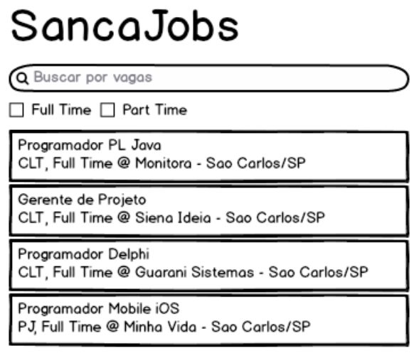

#React

##Apresentação

Rápida introdução aos fundamentos do React ([link](https://docs.google.com/presentation/d/1LIq_z2OTSzRI5oI1Gr3-lSw9j0PmFeDQWlZ_bGYtXAE/edit?usp=sharing)).

####Fundamentos

 1. Componentes
 2. Single Source of Truth
 3. One way data flow
 4. Prop & State
 5. Pensando em React
 6. Virtual DOM
 7. Vantagens

##Mãos à obra

Vamos construir um app simples para listar vagas de emprego. Durante o exercício abordaremos:

[Getting started](./GET-STARTED.md)

 1. Prop validations
 2. DOM Refs
 3. Handling Events
 4. Component Lifecycle
 5. Higher Order Component
 6. React DevTool

##O que não veremos?

 1. Unit test
 2. Webpack
 3. Server rendering
 4. Router
 5. React Native

##Speaker

Vinícius Lemes ([Github](http://github.com/lemes))

##Referências

 1. [Facebook React](https://facebook.github.io/react/)
 2. [ReactJS and why it's awesome](http://www.slideshare.net/AndrewHull/react-js-and-why-its-awesome)
 2. [ReactJS: Keep Simple. Everything can be a component](https://speakerdeck.com/pedronauck/reactjs-keep-simple-everything-can-be-a-component)
